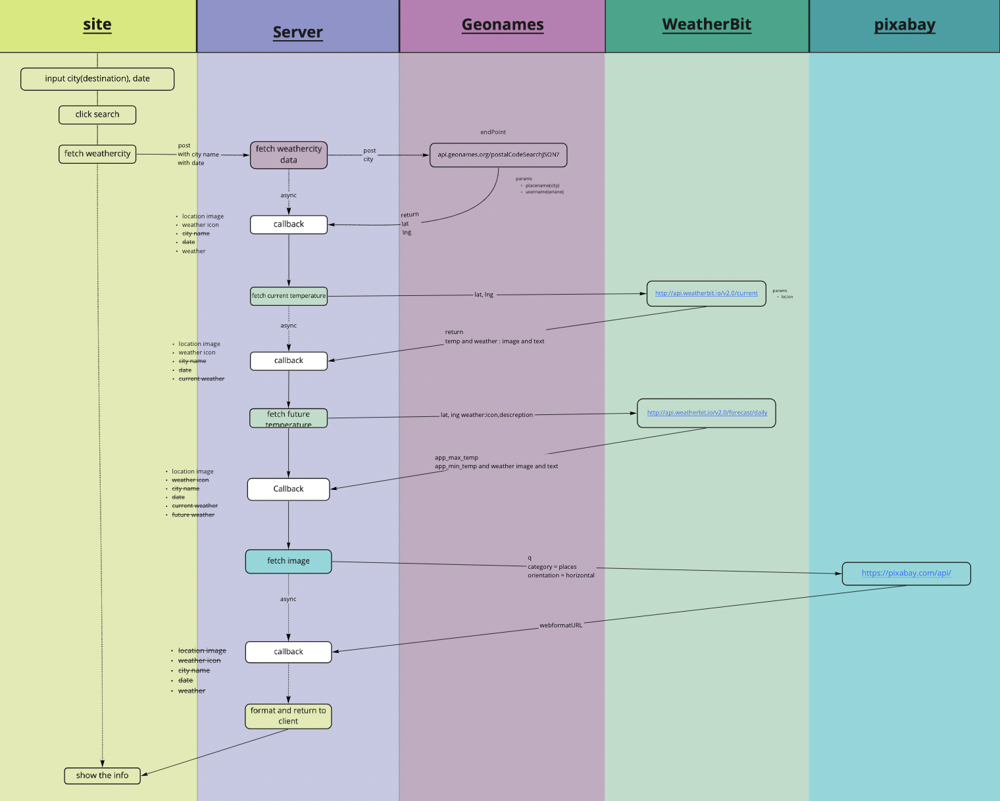

# Travel app

 ## Introduction 

This project is the final project for Udacity's Front End Web Developer Nanodegree program. The project includes elements from all of the projects that I have learned throughout the course. 
 
This graph so that you, reader, can understand the step by step of the line of reasoning elaborated for this project which also consists of using the server and 3 Apis for this project.

#### Api's 

- Geonames
- Weatherbit
- Pixabay

### Get Up and Running

To run the project node.js must be installed all depedencies then run the following commands:

- `npm install`
- `npm run build-dev`
- `npm run start` to server
- this app runs on http://localhost:8000/
- `npm run test` to make testing with jest

 ##### I also used Webpack to manage the dependencies

## Features

- With the destination of the trip you can have the maximum and minimum temperature forecast for the next 16 days.

- If the destination date is within 16 days, the day of the destination date will be highlight on the screen

- Current temperature, maximum and minimum temperature of the destination.

- How many days are left for the trip
